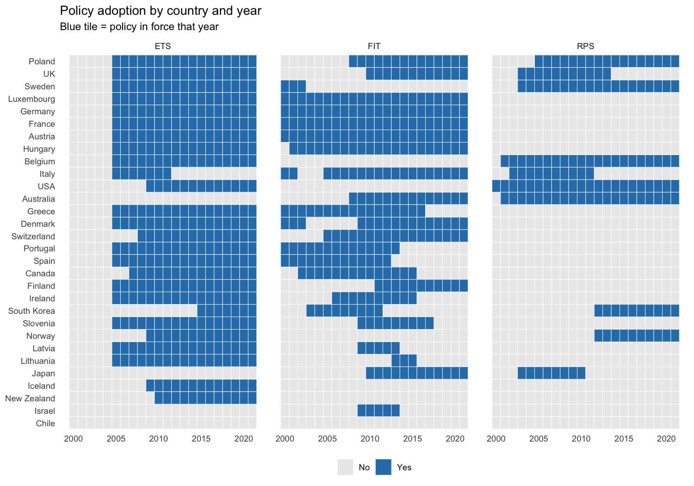
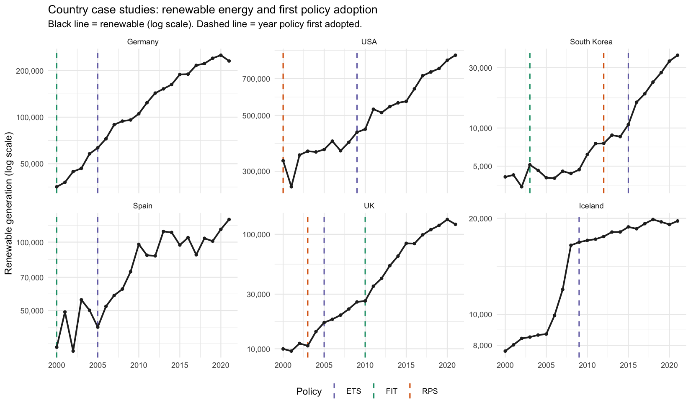
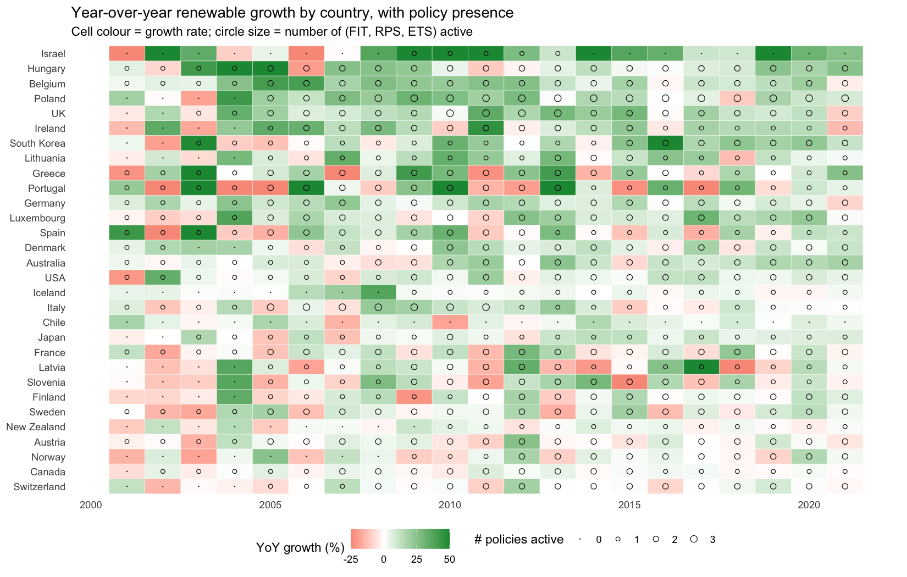

# Renewable Energy Policy & Capacity (R replication)

Replicating in R the panel-data analysis from Hyelim Won's master's thesis,
*"Which RE policy instruments are the most effective in achieving RE
expansion in OECD countries?"* (2000–2021, 30 OECD countries).

## Research question
Which renewable-energy policy instruments — Feed-in Tariffs (FIT),
Renewable Portfolio Standards (RPS), or Emission Trading Systems (ETS) —
are the most effective in driving renewable-energy expansion?

## Sample
30 OECD countries from 2000–2021. The 8 OECD members excluded for having
fewer than 10 years of data:
Czech Republic, Colombia, Costa Rica, Estonia, Mexico, Netherlands,
Slovakia, Türkiye.

## Specification (Table E in the thesis)
**DV:** `lnrenewable` = log(total renewable energy generation)

**Predictors:** policy variables at 1, 2, and 3-year lags (length of FIT,
price of FIT, ETS coverage, FIT/RPS/ETS dummies) plus controls (carbon
intensity, interest rate, land area, log GDP).

**Method:** Pooled regression with Panel-Corrected Standard Errors (PCSE).
The thesis runs Stata's `xtpcse , correlation(psar1)` which applies a
Prais-Winsten AR(1) transformation per panel before computing PCSE.

> **Caveat on R replication.** No CRAN package currently does panel-specific
> Prais-Winsten + PCSE on unbalanced panels (`panelAR` is archived).
> `R/03_pcse_regression.R` runs pooled OLS with Beck-Katz PCSE
> (`plm::vcovBK`). This matches the thesis on:
> - **Sample size** (N = 595 / 567 / 539 for L1/L2/L3) ✓
> - **N groups** (30) ✓
> - **Signs** of 7–8 of 10 coefficients per model ✓
>
> Magnitudes differ — R's coefficients are typically larger because the
> Stata version absorbs much of the variation through the AR(1) layer.

## Key visualizations

**Policy adoption across countries and time**
Each blue tile marks a year a policy was active. Most ETS adoption is the EU-wide 2005 launch; FIT is staggered; RPS is rare outside the US.



**Country case studies**
Six countries with distinctive policy histories. Dashed vertical lines mark the year each policy was first adopted.



**Year-over-year renewable growth, with policy presence**
Tile colour is YoY growth (red = decline, green = growth). Circles mark how many of FIT/RPS/ETS were active that year — bigger circle = more policies stacked.



## Project layout
```
R/                  analysis scripts (run in numeric order)
data/raw/           original Excel — never edit
data/processed/     cleaned/transformed data written by scripts
output/             figures (PNGs tracked; PDFs/CSVs gitignored)
```

## How to reproduce
```r
source("R/00_setup.R")            # one-time: install packages
source("R/01_load_data.R")        # Excel -> data/processed/panel.rds
source("R/02_build_variables.R")  # filter sample, build lags
source("R/03_pcse_regression.R")  # run Table E (3 lag models)
source("R/04_compare_thesis.R")   # side-by-side vs thesis values
source("R/05_visualizations.R")   # descriptive plots + Table E coefficients
source("R/06_policy_effect_plots.R")  # event study, case studies, treated vs untreated, growth heatmap
```

## Environment

`sessionInfo.txt` records the R version and exact package versions used.
If a package's behaviour changes in a future release and these scripts
break, you have a known-good reference point to roll back to.

Regenerate after upgrading packages:
```bash
Rscript -e "source('R/00_setup.R'); sink('sessionInfo.txt'); print(sessionInfo()); sink()"
```
